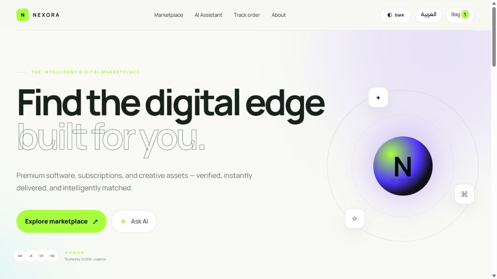
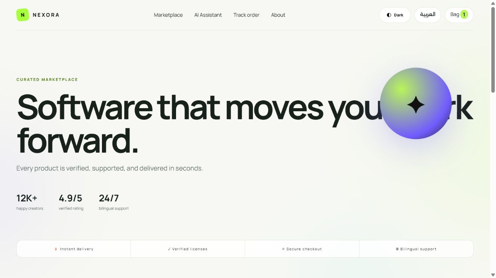
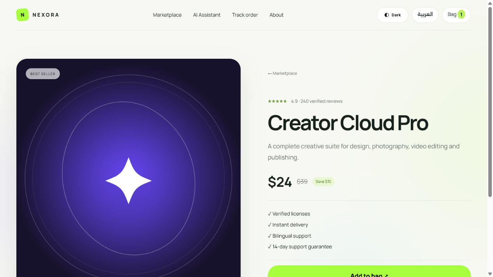
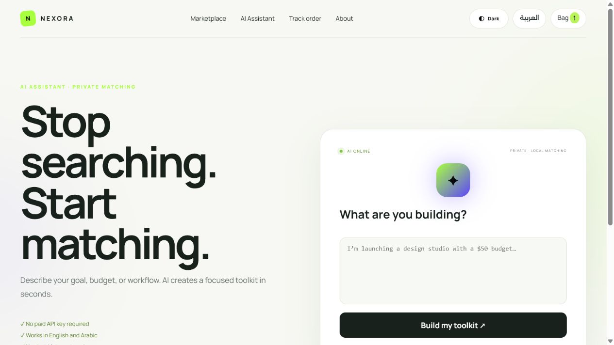
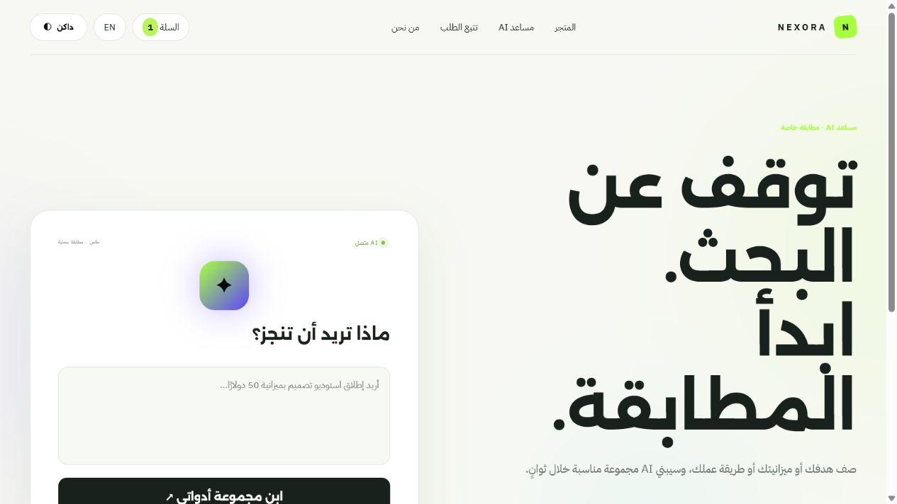

# Nexora — Laravel Digital Marketplace

Nexora is a polished bilingual marketplace for digital products, built with Laravel, PHP, MySQL, Blade, and a privacy-first local AI recommendation experience.



## Highlights

- Responsive multi-page storefront with light and dark themes
- Complete English and Arabic interfaces with RTL-aware layouts
- MySQL-backed catalog, orders, and order items
- Product pages, shopping cart, checkout, confirmation, and order tracking
- Private local AI product matcher with no paid API key
- Smooth motion, hover interactions, and reduced-motion support
- CSRF protection, server validation, Eloquent ORM, and escaped Blade output

## Screenshots

| Marketplace | Product details |
| --- | --- |
|  |  |

| AI assistant | Arabic experience |
| --- | --- |
|  |  |

All page captures are available in [`docs/screenshots`](docs/screenshots).

## Technology

- Laravel 9 and PHP 8
- MySQL / MariaDB
- Blade templates and Eloquent ORM
- HTML5, CSS3, and vanilla JavaScript
- Alexandria, IBM Plex Sans Arabic, and Manrope typography

## Local setup

```bash
composer install
copy .env.example .env
php artisan key:generate
```

Create a MySQL database named `nexora_laravel`, update the database credentials in `.env`, then run:

```bash
php artisan migrate --seed
php artisan serve
```

Open `http://127.0.0.1:8000`.
